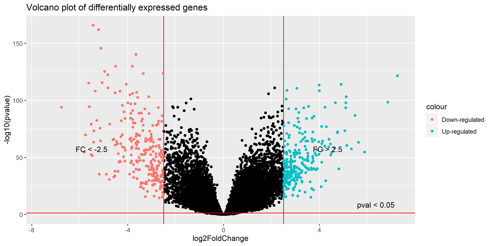

```{r setup, include=FALSE}
knitr::opts_chunk$set(echo = TRUE)
```

# Abstract

The aim of this project is to apply differential analysis on Kidney Renal Clear Cell Carcinoma (TCGA-KIRC) gene expression data from TCGA.

# Introduction

# Materials and methods

We can roughly divide the project into four parts: data preprocessing and gathering, discovering differentially expressed genes(DEGs), co-expression network analysis and differential co-expressed network analysis.

## Data preprocessing and gathering

Data was gathered from [National Cancer Institute GDC Data Portal](https://portal.gdc.cancer.gov/). For the latter task, we used the R code snippet provided by professor. Data was formed into dataframe and the genes with at least one zero expression, were filtered out. Also, only subjects with both normal and cancer tissue gene expression data available were kept for further analysis. From dataset of 611 subjects and \~60000 genes, only 144 subjects with 17759 genes were left.

Lastly, we shaped the dataset into form that it could be made into *DESeqDataSet* to use the data with *DESeq2* provided R tools.

```{r}
library("DESeq2")
load("CountData.RData")

#rename condition row to "condition"
rownames(dataFull1) = c(rownames(dataFull1)[1:nrow(dataFull1)-1],"condition") 


#add subjects' name a term of their tissue status
colus = colnames(dataFull1)
conds = dataFull1[nrow(dataFull1),]
col_con = paste0(colus, paste0(".",conds)) 
colnames(dataFull1) = col_con

#make a vector of conditions and samples
coldata <- t(dataFull1["condition",]) 

#check if corresponding names are same to feed the data to DESeq
all(rownames(coldata) == colnames(dataFull1)) 

#make counts numeric
numeric_data <- sapply(dataFull1[1:nrow(dataFull1)-1,], as.numeric)
rownames(numeric_data) = rownames(dataFull1)[1:nrow(dataFull1)-1]

#making data into DESeqDataSet 
dds <- DESeqDataSetFromMatrix(countData = numeric_data, 
                              colData = coldata,
                              design = ~ condition)
dds
saveRDS(dds, file = "dds.rds")

```

The result as DESeqDataSet is in the right shape to be fed into *DESeq* function that will be used to determine the differentially expressed genes.

# Discovering differentially expressed genes

After preprocessing, we applied the *DESeq* method on the data and find the differentially expressed genes. In simple words, we are going to find out if the cancer tissue genes are somehow differently expressed then normal tissue genes of the same subjects.

```{r}
library("ggplot2")
library("dplyr")

dds <- DESeq(dds)
res <- results(dds, alpha = 0.05)
res
hist(res$pvalue)
```

The result is a dataframe of genes and their corresponding expression characteristics depending on the condition. From the histogram we can see that we have to do some filtering to actually acertain the desired genes.

For this we used log2 foldchange of 2.5 and adjusted pvalue of 0.05 as a threshold.

```{r}

#foldchange threshold
FC = 2.5

#prepering data for plotting
plot_data = dplyr::mutate(as.data.frame(res), gene_id = rownames(res)) %>% 
  dplyr::as_tibble() 

#filtering by log2foldchange and adjusted pvalue 
filtered_genes = dplyr::mutate(as.data.frame(res), gene_id = rownames(res)) %>% 
  dplyr::as_tibble() %>% 
  dplyr::filter(!is.na(padj)) %>% #Remove NA p-values
  dplyr::filter(padj < 0.01) %>% #Filter according to FDR
  #dplyr::filter(log2FoldChange>0) %>% # use if u want to have only up or down regulated genes
  dplyr::filter(abs(log2FoldChange) > FC) %>% #Filter according to fold-change
  dplyr::arrange(-log2FoldChange) #Sort by fold change

filtered_genes

```

The result of filtering is that we have arrived to 499 differently expressed genes. Let's also plot the results as a volcano plot.

```{r}

cuts <- data.frame(Ref = c(paste0("FC < ",-FC),paste0("FC > ",FC), "pval < 0.05"),
                   vals = c(-3*FC, FC, 4),
                   yes = c(50,50,-log10(0.05)),
                   stringsAsFactors = FALSE)


ggplot(data=as.data.frame(res), aes(x=log2FoldChange, y=-log10(pvalue))) + 
    geom_point() +
        geom_hline(yintercept=-log10(0.05), col="red") + geom_vline(xintercept=c(-FC, FC), col="red") +
  geom_point(aes(color = "Up-regulated"), data = ~ .x %>% filter(log2FoldChange > FC ))+
  geom_point(aes(color = "Down-regulated"), data = ~ .x %>% filter(log2FoldChange < -FC ))+
  geom_text(mapping = aes(x = vals,
                          y = yes,
                          label = Ref,
                          hjust = -1,
                          vjust = -1),
            data = cuts)+ ggtitle("Volcano plot of differentially expressed genes")

ggsave("volcano.png", width = 10, height = 5)
```



# Co-expression network analysis

(for making the graph, I suggest ggraph (or at least I have used it and it provided beautiful output) and it should also provide the graph analysis tools. Also we can continue in the 3rd and 4th task with count data and just normalize them as stated in the slides of the 6th lecture.)

```{r}
#Here are the significantly expressed genes
expressed_genes = filtered_genes$gene_id 

```

```{r}
load("NumericFPKM.RData")
library(WGCNA)

## loaded numeric_dataFPKM it has an equivalent form to the numeric_data
## data frame, but is based on FPKM data instead of count data

#Here are the significantly expressed genes
expressed_genes = filtered_genes$gene_id 

#Only keep the rows of numeric_dataFPKM that contain DEGs
DEG_FPKM <- numeric_dataFPKM[expressed_genes,]

#579 rows remain

#Split the data frame into two parts (cancer and normal)
#in the following, apply the same calculations to both parts

DEG_FPKM_split <- list(normal = DEG_FPKM[, 1:(ncol(DEG_FPKM)/2)],
     cancer = DEG_FPKM[, (ncol(DEG_FPKM)/2 + 1):ncol(DEG_FPKM)])


## apply transformation log2(x + 1) to both data frames
## see last slide of "6. Differential Co Expression Analysis of Gene Expression"
## slide set

DEG_FPKM_split <- lapply(DEG_FPKM_split, function(dat)log2(dat + 1))

## Calculate correlation matrix
DEG_FPKM_split <- lapply(DEG_FPKM_split, function(dat)WGCNA::cor(t(dat)))

## Use Pearson's correlation


### Use absolute correlation
### DEG_FPKM_split <- lapply(DEG_FPKM_split, abs)


## For now: choose tau = 0.85
## I also tried tau = 0.7, but found the resulting networks way to dense to
## see anything

## Should we make a parameter selection segment in the appendix of the reoprt
tau <- 0.85


## Set negative correlations to zero (don't do this, if we have absolute correlations)
DEG_FPKM_split$normal[DEG_FPKM_split$normal < 0] <- 0
DEG_FPKM_split$cancer[DEG_FPKM_split$normal < 0] <- 0


## apply signum function to get binary adjacency matrix
DEG_FPKM_split2 <- lapply(DEG_FPKM_split, signumAdjacencyFunction, threshol= tau)


## calculate connectivity (for each nodes, i.e. the total number of connections 
## this node has)
connect <- lapply(DEG_FPKM_split2, rowSums)

## Make a histogram of the conenct vector, to check if the network is
## approximately scale free

## histogram for normal tissue
dat_norm <- data.frame(connect$normal)
ggplot(data = dat_norm, aes(connect.normal)) +
  geom_histogram( aes(x = connect.normal, y = ..density..), fill="#69b3a2" ) +
  ggtitle("Degree distribution in normal tissue") +
  xlab("degree") 

## histogram for cancer tissue
dat_can <- data.frame(connect$cancer)
ggplot(data = dat_can, aes(connect.cancer)) + 
  geom_histogram( aes(x = connect.cancer, y = ..density..), fill="#69b3a2" ) +
  ggtitle("Degree distribution in cancer tissue") +
  xlab("degree") 


## Both networks have a really high number of nodes without connections to any
## other nodes. This does not really mean that the model is scale free

## the cancer model has more closely connected nodes

## compute degree index

## calculate N
N <- ncol(DEG_FPKM_split2$normal)

## Calculate Average Degree
lapply(connect, function(x)sum(x)/N)

## Cancer genes are way more connected

## Identify the hub genes

## list of hub genes - normal condition


## calculate the 0.95 quantile of the empirical distribution of degrees over 
## nodes to get the hub genes

## Get the names of hub genes from both datasets

hub_name <- sapply(connect, function(con){
  
  #95% quantile of the degrees
  qu <- quantile(con, 0.95)
  
  #keep all observations greater than the quantile as hubs
  #extract according gene names
  names(con)[con > qu]
})


## merge to vector and remove doubled entries
hub_name <- unique(as.character(unlist(hub_name)))


## extract degrees of these genes

## turn list containing the degrees into a data frame
connect_matrix <- do.call(cbind, connect)

## extract the genes with a high degree value (over 0.95 quantile)
connect_hub <- data.frame(connect_matrix[hub_name,])


## reorder by cancer degree level (looks better in the plot below)
ord <- order(connect_hub$cancer)
connect_hub <- connect_hub[ord,]

## add column with gene names
connect_hub$gene <- factor(rownames(connect_hub), levels = rownames(connect_hub))


## give this data to the lollipop plot
## Plot
ggplot(connect_hub) +
  geom_segment( aes(x=gene, xend=gene, y=normal, yend=cancer), color="grey") +
  geom_point( aes(x=gene, y=normal), color=rgb(0.2,0.7,0.1,0.5), size=1 ) +
  geom_point( aes(x=gene, y=cancer), color=rgb(0.7,0.2,0.1,0.5), size=1 ) +
  coord_flip()+
  #theme_ipsum(axis_text_size = 3) +
  
  theme(legend.position = "none",
    axis.text.x = element_text(size =10),
    axis.text.y = element_text(size = 7)
  ) +
  xlab("") +
  ylab("Degree of Gene") +
  ggtitle("Degree in cancer (red) vs. normal (green) tissue") 


## Make network graph

library(igraph)
library(ggraph)

## choose either the normal or cancer tissue here (for vizualization)
dat <- DEG_FPKM_split2$cancer

## All connections of one hub gene
hub_con <- dat["ENSG00000138964",] == 1

## Matrix showing all the gene's connections
hub2 <- dat[hub_con, hub_con]

## Put this into the rigth format for ggraph
net <- graph_from_adjacency_matrix(hub2 , mode='undirected', diag=F )

V(net)$degree <- degree(net)

ggraph(net, layout = 'igraph', algorithm = "fr") + 
  geom_edge_link0(edge_width = 1, edge_alpha = 0.7) +  
  geom_node_point(aes(size = degree), colour = 'forestgreen') + 
  geom_node_text(aes(label = name, filter = degree > 50), color = 'white', 
                 size = 3) + 
  ggforce::theme_no_axes()
  
  
```

Here is a website I found, where they describe how to convert the Gene_IDs we have into the gene's names. Maybe this is helpful for the last part of the task:
https://stackoverflow.com/questions/28543517/how-can-i-convert-ensembl-id-to-gene-symbol-in-r
